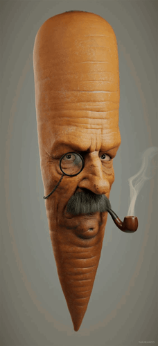

<h1 align="center">Hi 👋, I'm Lucas Toniolo Madalena</h1>
<h3 align="center">A Systems Development student at ETEC in Pirssununga</h3>
<align-center>
</align-center>

- 🔥 I’m currently working on **Oven automation**

- 📖 I’m currently learning **Python, C++, HTML, CSS, JavaScript, SQL;**

- 🎮 I’m looking to collaborate on **Stars Enigmas**

- 💬 Ask me about **Programming**

- 📫 How to reach me **lucastmadalena@gmail.com**

<h3 align="left">Connect with me:</h3>

<h3 align="left">Languages and Tools:</h3>

      

